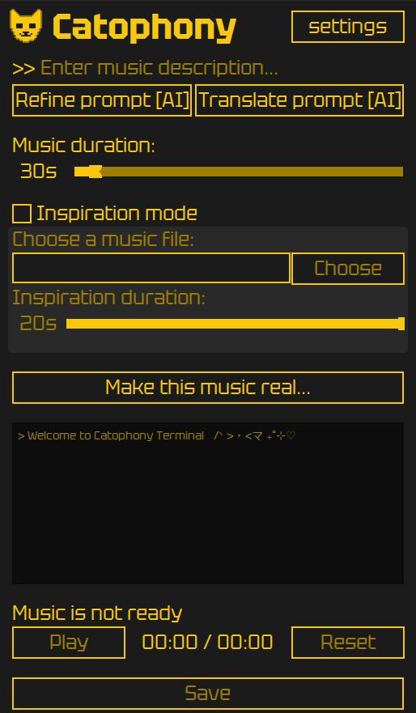
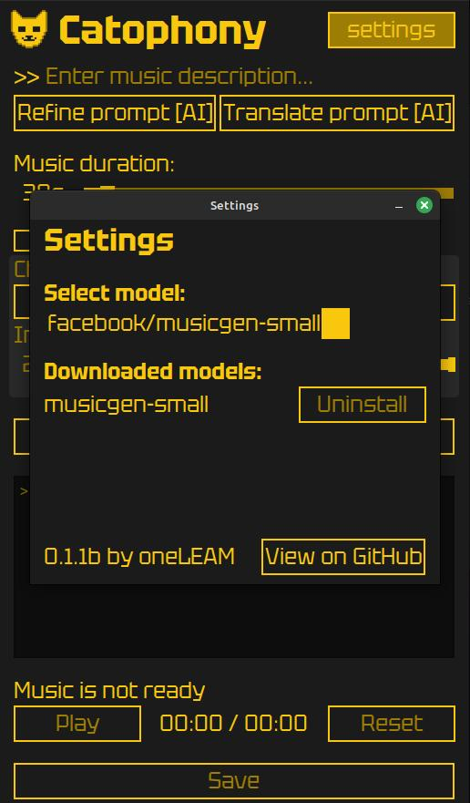

# Catophony
**A user-friendly GUI for running Facebook's MusicGen (small, medium, large) on CPU**

## Download for Linux and Windows

*Requires a decent CPU and at least 16GB of RAM.*

## Features

* 🎹 Generate up to 5 minutes of unique music with a single button press.
* 🎨 Enjoy a sleek, minimalist dark interface with a distinctive design style.
* 💡 Create new music inspired by your existing audio files.
* 🚀 Launch effortlessly with automatic model downloading and zero manual setup.
* 🤖 Translate and refine your prompts for the best generation results.
* 💾 Listen to your generated music instantly and save your tracks in various formats.

## Screenshots

Loading Screen 
 
Main Window 
 
Settings Window 
 

